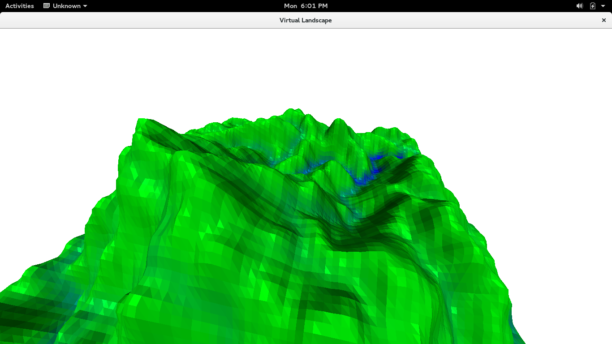
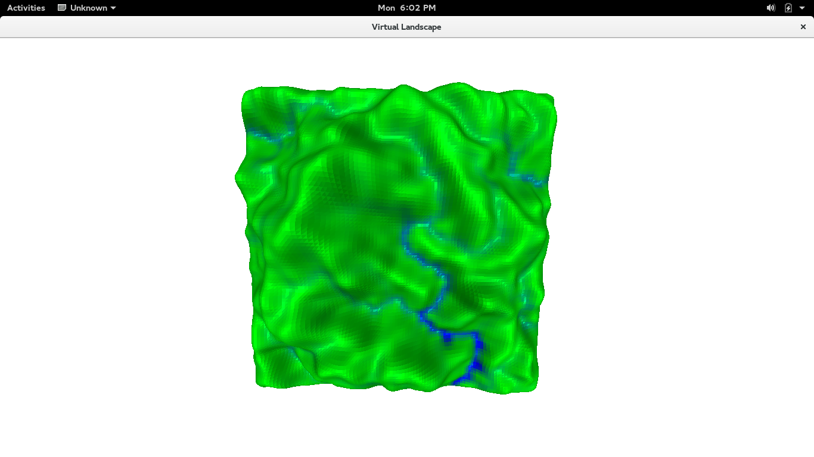

# landscape
Procedurally generated landscapes with well-behaved watersheds.

This program generates elevation data for an imaginary landscape.
The goal is to make reasonable drainage basins, a la Appendix A.3
of *The Science of Fractal Images*, eds. Peigen and Saupe.  (The appendix
is by Mandelbrot).

The basic algorithms for generating fractal mountains create landscapes
that are unreasonably symmetric between Up and Down.  Realistically,
there should be differences.  For instance, most mountain ranges
have far more local maxima (peaks) than local minima (bottoms of lakes?).

Mandelbrot's method is based on a prescribed river network
that is deterministically generated.  The elevation data is
generated randomly in terms of this river network.

Here, we generate the river network randomly, and, for the moment,
generate the elevations deterministically from the river network.

The river network is obtained by creating a random maze on a 128x128 grid.

Given the layout of rivers, we impose some constraints on elevation:

* Rivers must flow downhill
* Nothing is too steep (a sort of continuity requirement)
* Rivers that drain substantial areas are especially flat.

We then calculate the maximum elevations that satisfy all these
constraints.

## Usage

A python program `height_gen.py` generates the elevation data,
and other auxiliary data, storing them in txt files.
A program written in C is then
used to view the data.

Basic usage is as follows:

    make
    python3 height_gen.py
    ./program

Near the start of `height_gen.py` are some parameters which can
be changed, to change the algorithm.  Another line sets the seed
for the random number generator, which is currently fixed to compare
different algorithms applied to the same river network.

The program generated by the makefile can take a file name as a
parameter

    ./program alternate-heights.txt

and this can be used to compare alternate height data.

### The Viewer
The controls on the viewing program are screwy at the moment:

* The space bar smooths the landscape, which is initially jagged.
* Mousewheel zooms in and out.
* Dragging turns the world around the position of the viewer.
* Left-click dragging shifts the world left/right, or forward/backwards
  (not up/down).
* `w` and `s` move forward or backwards.
* `a` and `d` turn the camera to the left or right.
* the arrow keys shift the world left, right, up, or down.
* `HOME` makes the camera face a perfectly horizontal direction.

## Screenshot

